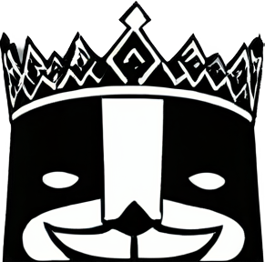
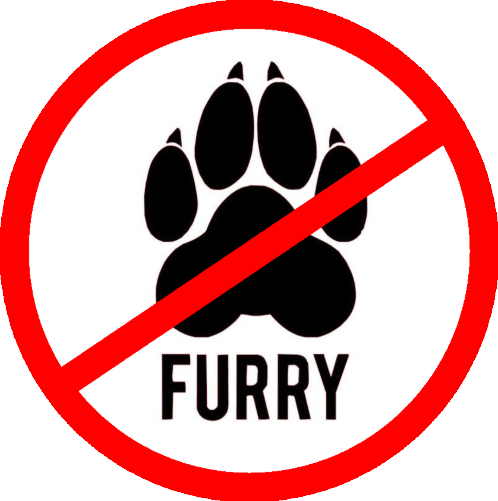

</a>

# Noodles
## Public Attack Panel
- DDoS 🛜
- Credential Stuffing 💳
- Tor Capabilities 🧅
- Defacement </a>

# What is this?
Noodles is a specially designed web application, or attack panel to disturb the every day operations of a site.

# Why are you doing this?
I've seen multiple things on the internet, or darkweb that I found extremely disturbing, such as gore, or CP.  This has severly messed with me over the last few months and I decided to finally take action.  This panel is more of a final resort,but the best way to deal with it is https://ic3.gov

⚠️*This may **ONLY** be used ethically, and on sites that genuinly deserve it*

# How is this maintained
It is not made by humans at all.  I figured I don't have time but would still like to create this to take action upon these bad sites.  I am using [🚀Project Auto🚀](https://discord.gg/GEkyGWAPge) automation, to create this using clever prompts and engineering to get what I want out of the AI.  Obviously since it's not human, it will have errors just like us, so I will go back and fix them once I think this is production ready. Once fixed I may even restart Project Auto to let it continue developing with fixed bugs.

</a>

---------------------------------------

</a>

--------------------------------------

